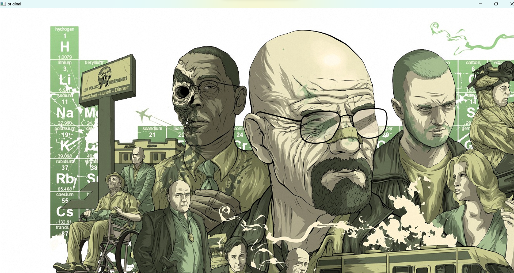
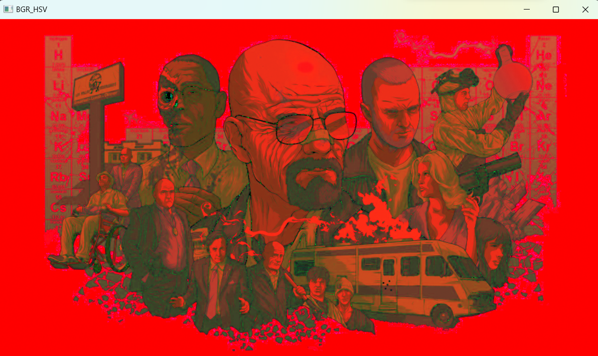
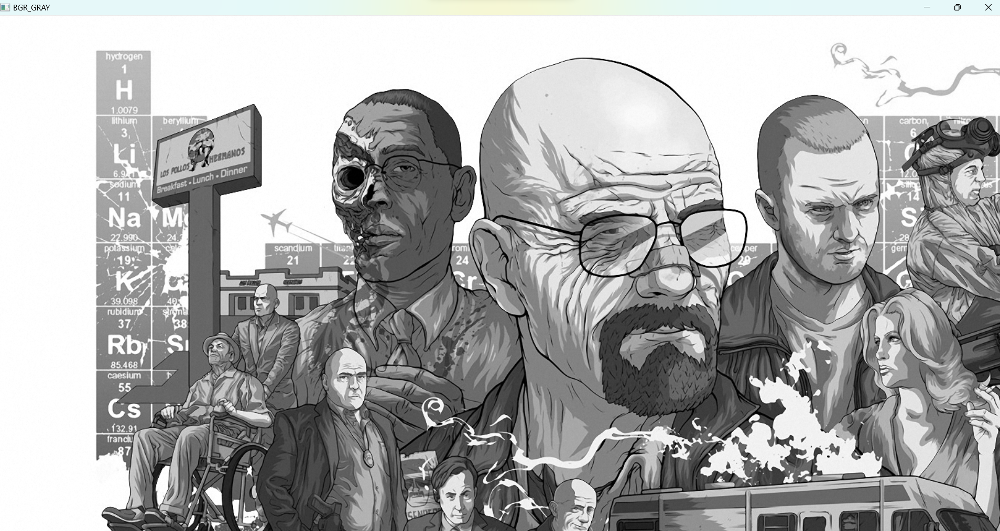
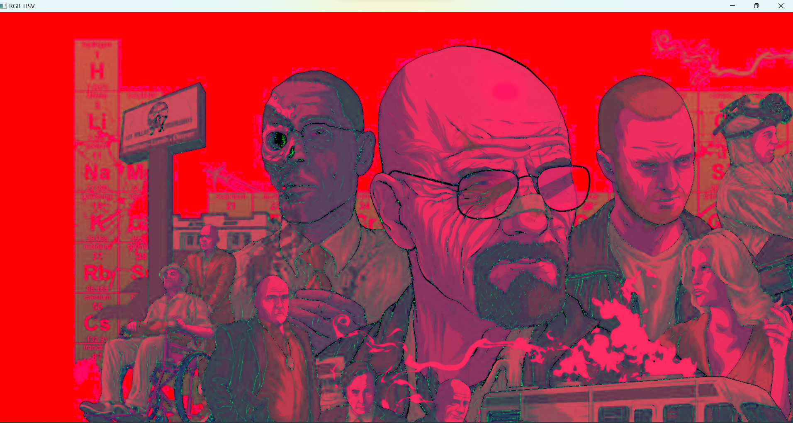
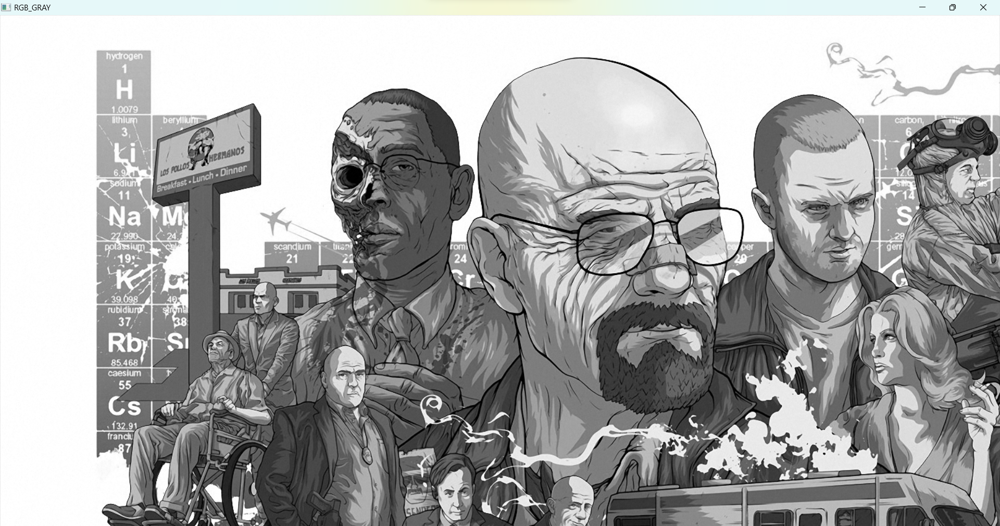

# COLOR-CONVERSION
## AIM
To perform the color conversion between RGB, BGR, HSV, and YCbCr color models.

## Software Required:
Anaconda - Python 3.7
## Algorithm:
### Step1:
<br>

### Step2:
<br>

### Step3:
<br>

### Step4:
<br>

### Step5:
<br>

## Program:
```python
# Developed By:Prethiveerajan P 
# Register Number:212221230079
# i) Convert BGR and RGB to HSV and GRAY

# BGR TO HSV

import cv2
image =cv2.imread('caap.png')
cv2.imshow('original',image)
resized_img = cv2.resize(image, None, fx=0.5, fy=0.5, interpolation=cv2.INTER_LINEAR)
b_h=cv2.cvtColor(resized_img,cv2.COLOR_BGR2HSV)
cv2.imshow('BGR_HSV',b_h)
cv2.waitKey(0)
cv2.destroyAllWindows

# BGR TO GRAY
import cv2
image =cv2.imread('caap.png')
cv2.imshow('original',image)
b_g=cv2.cvtColor(image,cv2.COLOR_BGR2GRAY)
cv2.imshow('BGR_GRAY',b_g)
cv2.waitKey(0)
cv2.destroyAllWindows

# RGB TO HSV
import cv2
image =cv2.imread('caap.png')
cv2.imshow('original',image)

r_h=cv2.cvtColor(image,cv2.COLOR_RGB2HSV)
cv2.imshow('RGB_HSV',r_h)
cv2.waitKey(0)
cv2.destroyAllWindows


# RGB TO GRAY
import cv2
image =cv2.imread('caap.png')
cv2.imshow('original',image)

r_g=cv2.cvtColor(image,cv2.COLOR_RGB2GRAY)
cv2.imshow('RGB_GRAY',r_g)
cv2.waitKey(0)
cv2.destroyAllWindows


# ii)Convert HSV to RGB and BGR


# iii)Convert RGB and BGR to YCrCb


# iv)Split and Merge RGB Image


# v) Split and merge HSV Image


```


## Output:
### i) BGR and RGB to HSV and GRAY:






<br>
<br>

### ii) HSV to RGB and BGR
<br>
<br>

### iii) RGB and BGR to YCrCb
<br>
<br>

### iv) Split and merge RGB Image
<br>
<br>

### v) Split and merge HSV Image
<br>
<br>


## Result:
Thus the color conversion was performed between RGB, HSV and YCbCr color models.
